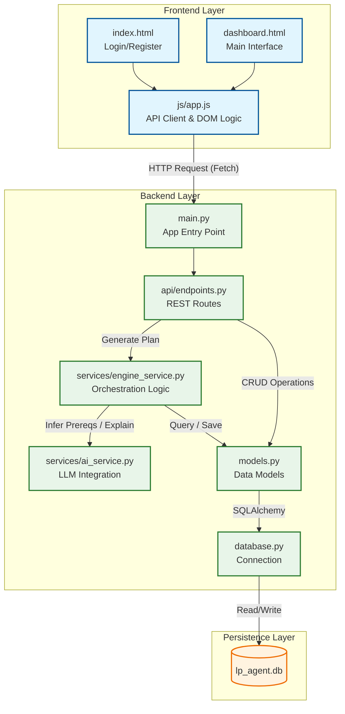
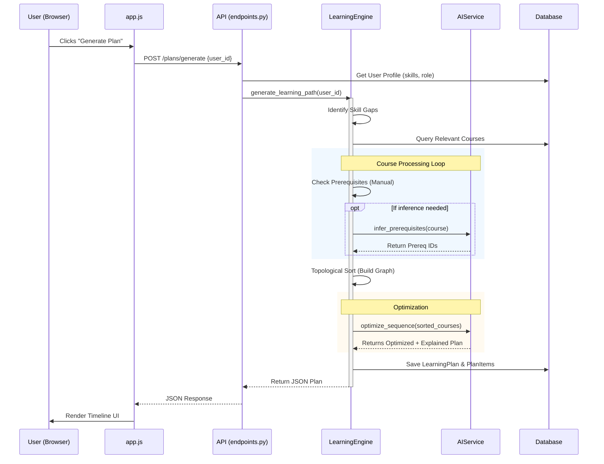
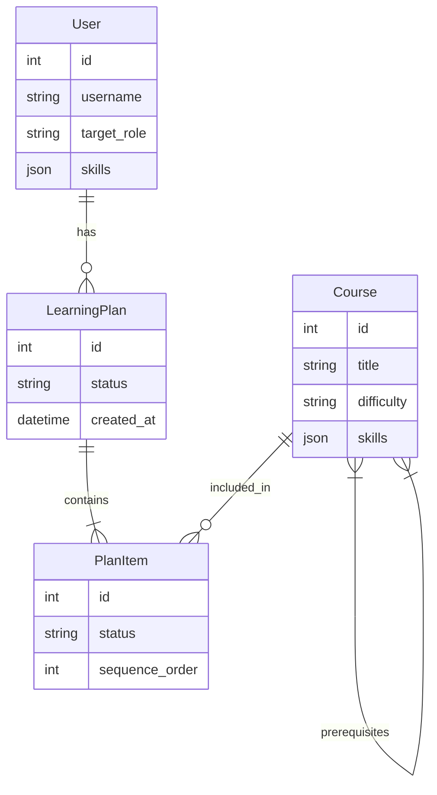

# Learning Path Agent - Architecture & Code Flow

This document provides a complete overview of the codebase, visualizing the data flow from the frontend user interaction to the backend logic and database.

## High-Level Architecture

The application follows a standard **Client-Server** architecture:

- **Frontend**: Vanilla HTML/JS/CSS (No frameworks).
- **Backend**: Python FastAPI.
- **Database**: SQLite (SQLAlchemy ORM).
- **External Services**: OpenAI API (for logic inference).

## Code Flow Visualization

### 1. Project Structure & Key Files

### 2. Detailed "Generate Plan" Sequence

This is the core workflow: taking a user profile and creating a personalized learning path.

## File Responsibilities

| Directory | File | Responsibility |
|-----------|------|----------------|
| **Backend** | `main.py` | Initializes FastAPI app, CORS, and database tables. |
| | `api/endpoints.py` | Defines URL routes (`/login`, `/plans/generate`) and calls appropriate services. |
| | `services/engine_service.py` | **Core Logic**. Handles graph algorithms (topological sort), prerequisite checking, and orchestrates the plan creation. |
| | `services/ai_service.py` | Interfaces with OpenAI to add intelligence (explanations, dynamic prerequisite discovery). |
| | `models.py` | Defines the database schema (`User`, `Course`, `LearningPlan`). |
| | `database.py` | Handles SQLite connection and session management. |
| **Frontend** | `index.html` | Login and Registration forms. |
| | `dashboard.html` | Main user interface waiting for dynamic content. |
| | `js/app.js` | Handles button clicks, API calls, and dynamically creating HTML elements to show the plan. |

## Data Models (ER Diagram)

